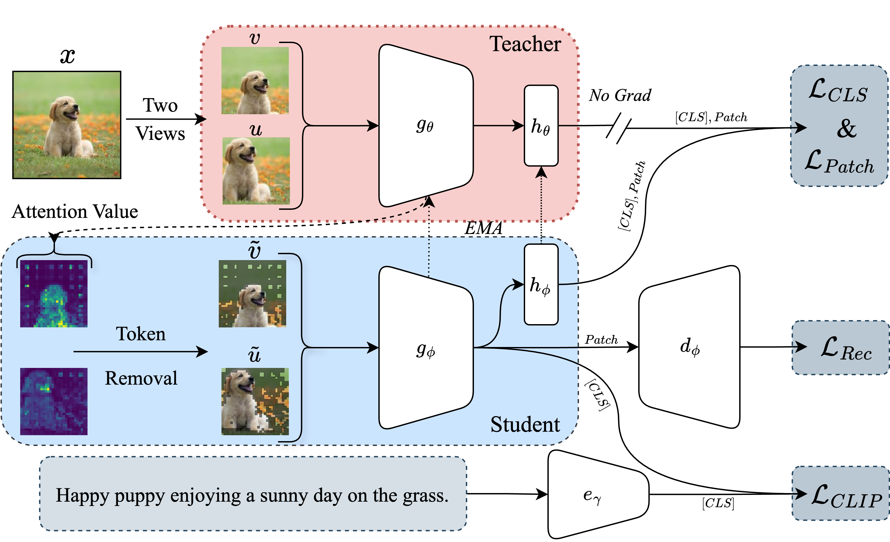

# DetailCLIP

DetailCLIP enhances CLIP-based models for fine-grained tasks like segmentation by using patch-level comparison and pixel-level reconstruction, with an attention-based token removal to focus on semantically relevant details. This results in superior segmentation accuracy and generalization across diverse datasets.

## Installation

Code tested with pytorch 2.0.0, torchvision 0.15.0, cuda 11.7, and timm 0.5.4.

YFCC15M Setup: Please refer to [SLIP](https://github.com/facebookresearch/SLIP/tree/main)'s repo.

## Usage

the code has been tested with SLRUM distrubted training. Sample SLURM script is provided in [sample_jobscript.sh](JOB/run.sh).

Zero-shot evaluation code from SLIP is provided in [eval_zeroshot.py](eval_zeroshot.py). Modify as needed for the model.

For semantic segmenation and object detection evaluation, refer to [IBOT](https://github.com/bytedance/ibot)'s repo.

[extract_backbone_weights.py](extract_backbone_weights.py) can be used to extract backbone weights from the model. This might be useful for evaluation and other downstream tasks.