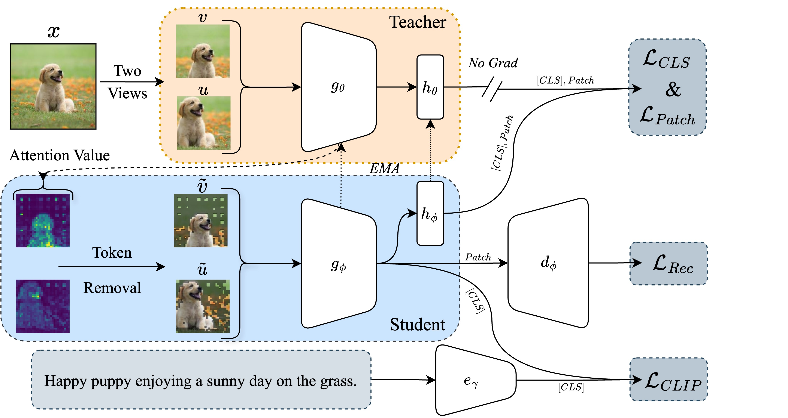
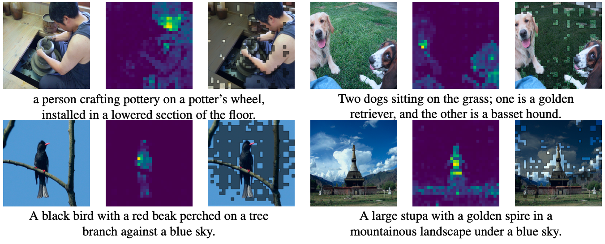
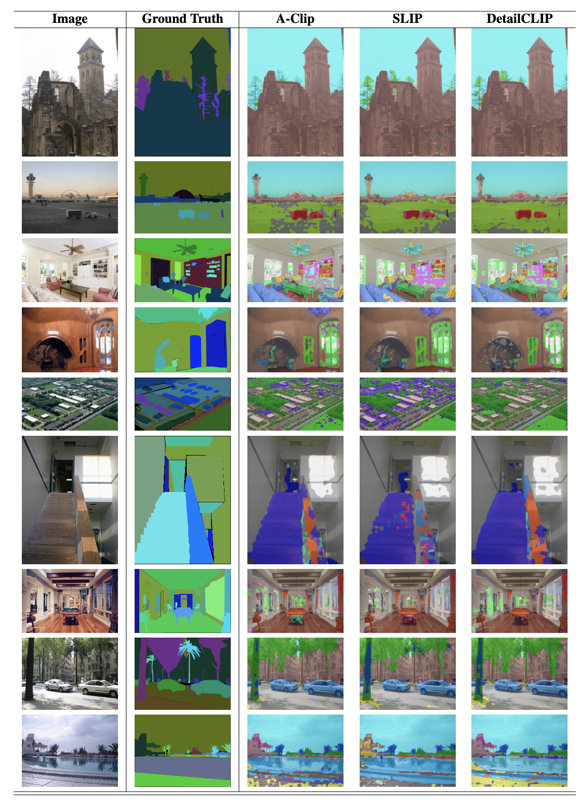
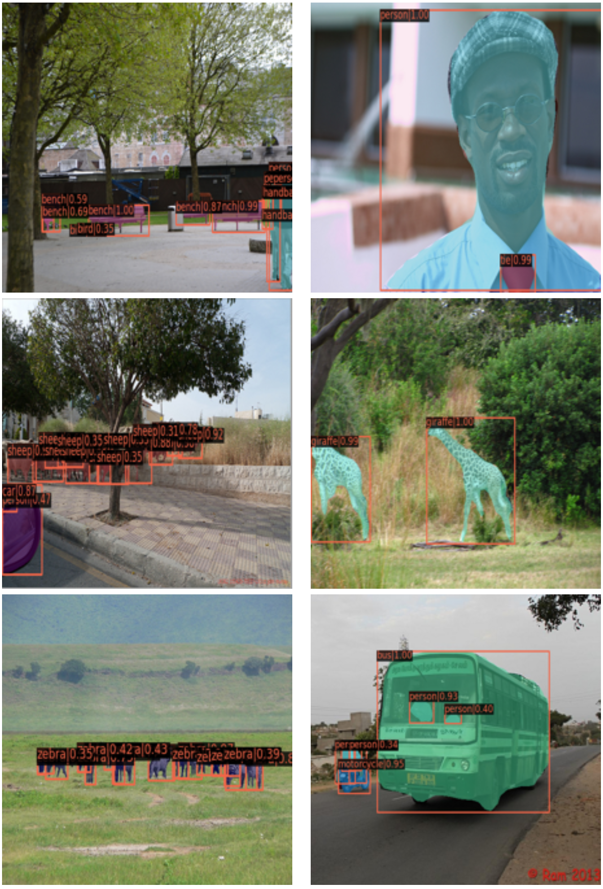
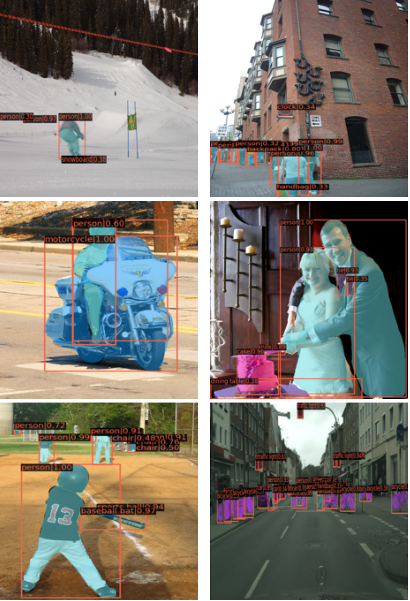

# [DetailCLIP](https://arxiv.org/pdf/2409.06809)

Detail-Oriented CLIP for Fine-Grained Tasks ([Amin Karimi Monsefi](https://7amin.github.io/), [Kishore Prakash Sailaja](https://github.com/KishoreP1), [Ali Alilooee](https://cse.osu.edu/people/alilooeedolatabad.1), [Ser-Nam Lim](https://sites.google.com/site/sernam), [Rajiv Ramnath](https://cse.osu.edu/people/ramnath.6))

DetailCLIP enhances CLIP-based models for fine-grained tasks like segmentation by using patch-level comparison and pixel-level reconstruction, with an attention-based token removal to focus on semantically relevant details. This results in superior segmentation accuracy and generalization across diverse datasets.




Performance comparison of various models on detail-oriented visual tasks, including segmentation and object detection. All
models utilize the vision component’s ViT-B (Vision Transformer Base) architecture. 

## Segmentation & Object Detection

| Methods   | Dataset | Epoch | Effective View | ADE20K (UperNet) | ADE20K (Linear) | COCO (AP^b) | COCO (AP^m) |
|-----------|---------|-------|----------------|------------------| --------------- |-------------|-------------|
| **Self-Supervised** | | | | | | |
| DeiT      | IN-1K   | 300   | 720M           | 47.4             |          -      | 44.1        | 39.8        |
| MAE       | IN-1K   | 800   | 960M           | 46.5             |        34.3     | 46.2        | 39.1        |
| DINO      | IN-1K   | 800   | 960M           | 46.8             |        34.5     | 47.4        | 40.1        |
| iBOT      | IN-1K   | 300   | 720M           | 47.3             |        34.7     | 48.4        | 42.1        |
| AttMask   | IN-1K   | 300   | 432M           | 47.5             |        35.2     | 48.9        | 42.2        |
| **CLIP-Based Model** | | | | | | |
| CLIP      | 400M    | -     | -              | 46.4             |         34.2    | 43.6        | 39.5        |
| SLIP      | YFCC-15M| 25    | 750M           | 46.6             |         36.1    | 44.0        | 40.3        |
| MaskCLIP  | YFCC-15M| 25    | 750M           | 47.5             |         36.3    | 45.8        | 40.9        |
| A-CLIP    | YFCC-15M| 25    | 750M           | 47.0             |         34.7    | 45.8        | 41.7        |
| DetailCLIP| YFCC-15M| 25    | 750M           | 48.1             |         37.3    | 48.9        | 42.5        |
| DetailCLIP| YFCC-15M| 50    | 1500M          | 48.8             |         39.3    | 50.1        | 43.3        |

Below includes the performance of DetailCLIP I2T and T2I retrieval on a COCO, Flickr30k, and Imagenet-1K.

## Image-to-Text and Text-to-Image Retrieval

| Methods   | E  | Flickr30K (I2T) | Flickr30K (T2I) | COCO (I2T) | COCO (T2I) | IN-1K (0-Shot) |
|-----------|----|-----------------|-----------------|------------|------------|----------------|
| CLIP      | 25 | 51.4            | 32.6            | 27.9       | 17.6       | 37.6           |
| SLIP      | 25 | 57.2            | 41.2            | 33.6       | 21.9       | 42.8           |
| MaskCLIP  | 25 | 60.0            | 38.8            | 34.1       | 21.2       | 42.7           |
| A-CLIP    | 25 | 62.7            | 42.1            | 38.0       | **23.2**       | **43.9**           |
| **DetailCLIP** | 25 | **62.8** | **42.2** | **38.3** | 22.9 | **43.9** |
| CLIP      | 50 | 53.9            | 35.8            | 30.2       | 19.2       | 39.4           |
| SLIP      | 50 | 60.6            | 41.1            | 33.2       | 22.3       | 44.1           |
| A-CLIP    | 50 | **66.7**            | 43.2            | **39.8**       | 24.4       | **46.3**       |
| **DetailCLIP** | 50 | 65.9 | **44.7** | **39.8** | **24.9** | 46.2 |


## Installation

Code tested with pytorch 2.0.0, torchvision 0.15.0, cuda 11.7, and timm 0.5.4.

YFCC15M Setup: Please refer to [SLIP](https://github.com/facebookresearch/SLIP/tree/main)'s repo.

## Usage

the code has been tested with SLRUM distrubted training. Sample SLURM script is provided in [sample_jobscript.sh](JOB/run.sh).

### Train DetaiCLIP ViT-B/16: 
```
python -m torch.distributed.launch --nproc_per_node=$NUM_PROC --nnodes=$NUM_NODES main.py \
--model DetailCLIP_VITB16  --dataset yfcc15m --metadata yfcc15m.pkl \
--output-dir output/$JOB_NAME --mask-ratio 0.5 --epochs 50 \
--batch-size 256 --lr 5e-4 --wd 0.5 \
--workers $NUM_WORKERS --clip_loss_weight 1 --ibot_patch_loss_weight 1 \
--ibot_cls_loss_weight 1 --reconst_loss_weight 1 --print-freq 1000
```
### Zero-shot evaluation
```
python eval_zeroshot.py --resume /path/to/checkpoint.pt
```

For semantic segmenation and object detection evaluation, refer to [IBOT](https://github.com/bytedance/ibot)'s repo. We use mmseg framework to run evaluations.

[extract_backbone_weights.py](extract_backbone_weights.py) can be used to extract backbone weights from the model. This might be useful for evaluation and other downstream tasks.


## Visualization

### Attention Maps and Token Removal


### Segmentation


### Object Detection
 

## Citation
If the code or paper helped your work, please cite:
```
@misc{monsefi2024detailclipdetailorientedclipfinegrained,
      title={DetailCLIP: Detail-Oriented CLIP for Fine-Grained Tasks}, 
      author={Amin Karimi Monsefi and Kishore Prakash Sailaja and Ali Alilooee and Ser-Nam Lim and Rajiv Ramnath},
      year={2024},
      eprint={2409.06809},
      archivePrefix={arXiv},
      primaryClass={cs.CV},
      url={https://arxiv.org/abs/2409.06809}, 
}
```

